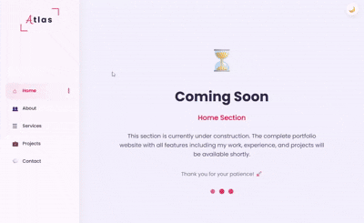

# Responsive Sidebar With Coming Soon Template

🌐 [Live Demo](https://mabbasdev.github.io/03-portfolio-template/)

A clean, responsive portfolio template with a collapsible sidebar navigation. This is the foundation for my complete portfolio website — the structure is ready, just need to add the content.

<div align="left" width="100%">
  
</div>

## Features
- **Responsive Sidebar**: 
  - Desktop (>1200px): Sidebar always visible on the left
  - Mobile (<1199px): Sidebar hidden by default, opens with hamburger icon
- **Dark/Light Mode Toggle**: Smooth theme switching with persistent states
- **Overlay on Mobile**: Dark overlay appears when sidebar is open (click to close)
- **Smooth Transitions**: Slide animations for sidebar and section changes
- **Ripple Effect**: Visual feedback when clicking navigation items
- **"Coming Soon" Placeholders**: All sections have animated placeholder content
- **Custom Scrollbar**: Styled scrollbar matching the theme
- **No External Dependencies**: Custom icon system using emojis/text

## What I Used
- HTML5
- CSS3 (Variables, Flexbox, Animations, Transitions, Media Queries)
- Vanilla JavaScript
- Custom icon system (no external libraries)

## Responsive Behavior

| Screen Size | Sidebar | Navigation |
|------------|---------|------------|
| > 1200px | Always visible on left | Direct click |
| < 1199px | Hidden by default | Hamburger icon toggles sidebar |

## Things I Learned / Practiced

**JavaScript**
- DOM manipulation for sidebar toggling
- Creating separate `openSidebar()` and `closeSidebar()` functions
- Overlay management for mobile
- Window resize event handling
- Class toggling for active states
- Ripple effect animation on click
- Dynamic dark mode toggle creation

**CSS**
- CSS Variables for theming (light/dark mode)
- Media queries for responsive breakpoints (1200px, 1199px, 767px, 480px)
- Keyframe animations (`sliderSection`, `ripple`, `pulse`)
- Pseudo-elements (`::before`, `::after`) for decorative borders
- Backdrop filter for blur effects
- Z-index management for layered UI (sidebar, overlay, toggler)
- Custom scrollbar styling
- Flexbox for centering content
- Gradient backgrounds and text effects

**Advanced Concepts**
- Mobile-first responsive approach
- Position fixed for sidebar and toggler
- CSS transitions for smooth interactions
- Emoji-based icon system (no external libraries)
- Overlay pattern for mobile menus

## Project Structure
```
03-portfolio-template/
├── index.html         
├── 03_portfolio_demo.gif
└── README.md           
```

## How to Run
1. Clone the repo
2. Open `index.html` in any browser
3. **On desktop (>1200px)**: Sidebar visible by default
4. **On mobile/tablet (<1199px)**: Click hamburger icon (top-left) to open sidebar
5. Click the overlay or any nav link to close sidebar
6. Click moon/sun icon (top-right) to toggle dark mode
7. Click navigation items to switch between placeholder sections

## Sections
- **Home** - Welcome section (Coming Soon)
- **About** - About me placeholder
- **Services** - Services offered placeholder
- **Projects** - Project showcase placeholder
- **Contact** - Contact form placeholder

## Connect
- GitHub: [@mabbasdev](https://github.com/mabbasdev)
- LinkedIn: [Connect with me](https://www.linkedin.com/in/mohd-abbas-778b12262/)
- X: [@mabbasdev](https://x.com/mabbasdev)

## What's Next (To Be Added)
- Profile image and personal info
- Skills progress bars
- Education and experience timeline
- Project cards with live demos
- Functional contact form
- Downloadable resume/CV
- Actual content for all sections

---

The structure and responsive behavior are solid. Now I just need to fill in the content to make it a complete portfolio.
